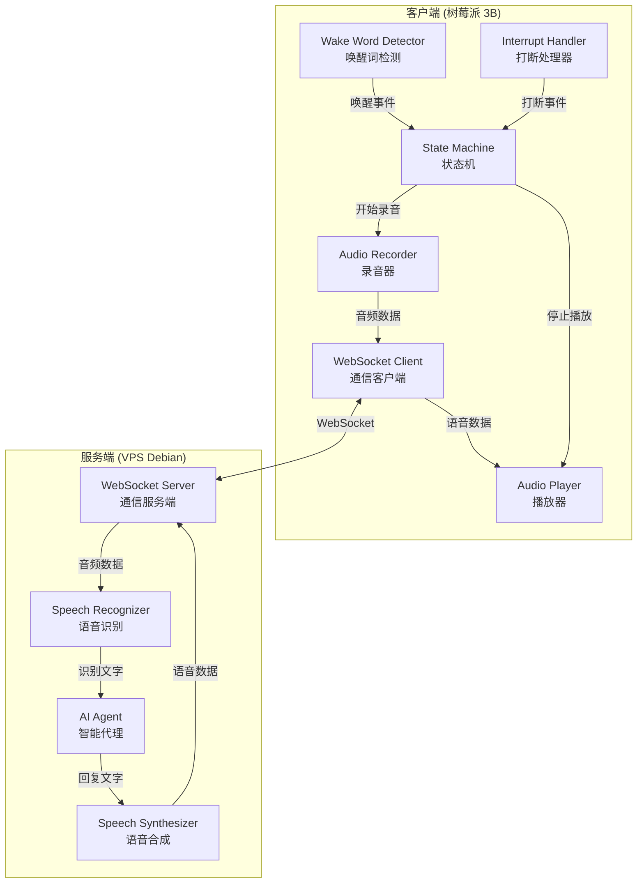
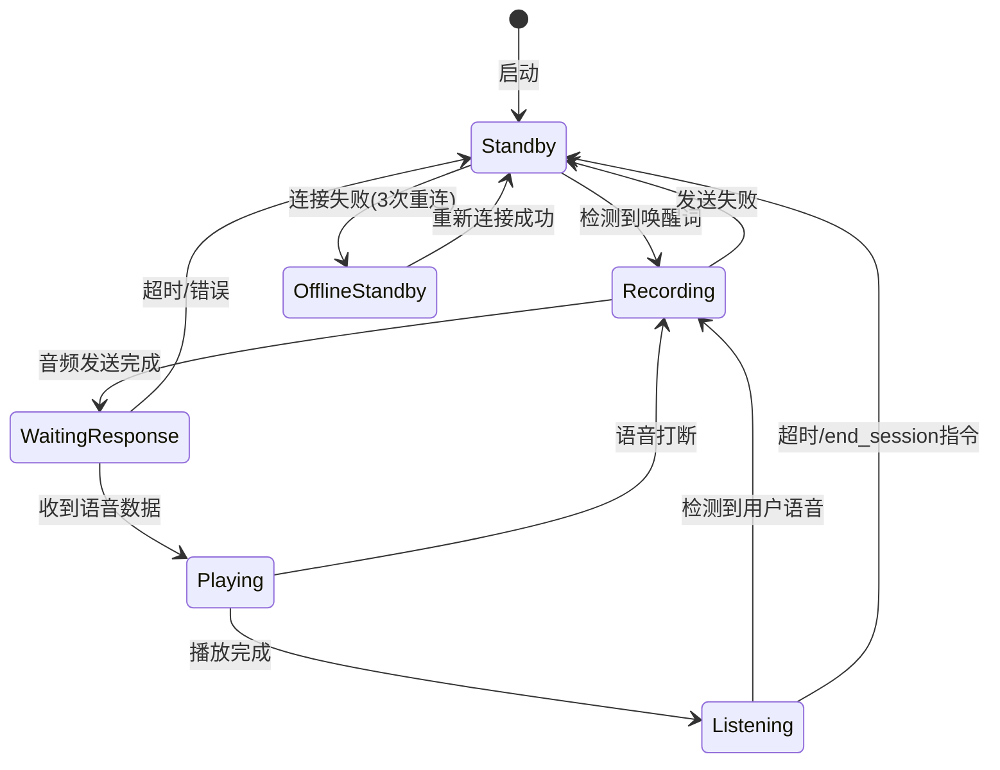

# 技术设计文档：语音助手系统

## 概述

语音助手系统采用客户端-服务端架构，客户端（树莓派 3B）负责语音交互的前端功能（唤醒、录音、播放、打断），服务端（VPS Debian）负责后端处理（语音识别、AI 推理、语音合成）。两端通过 WebSocket 协议进行实时双向通信。

系统使用 Python 作为主要开发语言，客户端利用 `pvporcupine` 进行唤醒词检测、`pyaudio` 进行音频采集与播放，服务端利用 `whisper.cpp`（通过 `pywhispercpp` Python binding）进行语音识别、`strands-agents` 进行 AI 推理、`edge-tts` 进行语音合成。

### 设计决策

| 决策 | 选择 | 理由 |
|------|------|------|
| 开发语言 | Python 3.11+ | 生态丰富，所有依赖库均有良好的 Python 支持 |
| 包管理工具 | uv | 极快的 Python 包管理器，用于项目初始化、依赖管理和虚拟环境 |
| 通信协议 | WebSocket | 支持全双工通信，适合实时音频流传输 |
| 唤醒词引擎 | Sherpa-onnx（默认）/ Porcupine（可选） | Sherpa-onnx 开源免费，直接传中文唤醒词；Porcupine 需要商业授权但检测精度高 |
| 语音识别 | whisper.cpp (pywhispercpp) | Whisper 的 C/C++ 实现，推理速度快，内存占用低，通过 pywhispercpp 提供 Python binding |
| AI Agent | AWS strands-agents | 需求指定，提供灵活的 Agent 编排能力 |
| 语音合成 | edge-tts | 免费、高质量中文语音，异步接口 |
| WebSocket 库 | websockets (Python) | 成熟的异步 WebSocket 库，客户端和服务端均可使用 |
| 音频格式 | WAV (客户端录制) / MP3 (TTS 输出) | WAV 无损适合识别，MP3 压缩适合网络传输 |
| 通信安全 | TLS (wss://) + 预共享 token | TLS 加密传输，token 认证客户端身份 |
| 多模型支持 | strands 内置 GeminiModel + OpenAIModel | 原生支持 Gemini 和 OpenAI 兼容接口（国内模型），无需额外依赖 |

## 项目结构

```
voice-assistant/
├── client/                    # 客户端（树莓派 3B）
│   ├── pyproject.toml         # uv 项目配置与依赖
│   └── src/
│       └── client/
│           ├── __init__.py
│           ├── main.py
│           ├── state_machine.py
│           ├── wake_word.py
│           ├── audio_recorder.py
│           ├── audio_player.py
│           ├── interrupt_handler.py
│           ├── wake_word.py          # 唤醒词工厂（根据配置选择引擎）
│           ├── wake_word_porcupine.py  # Porcupine 唤醒词实现
│           ├── wake_word_sherpa.py     # Sherpa-onnx 唤醒词实现
│           ├── wake_prompt.py
│           └── ws_client.py
└── server/                    # 服务端（VPS Debian）
    ├── pyproject.toml         # uv 项目配置与依赖
    ├── models.json            # 多模型配置
    ├── SOUL.md                # Agent 人格定义文件
    ├── MEMORY.md              # Agent 持久化记忆文件
    └── src/
        └── server/
            ├── __init__.py
            ├── main.py
            ├── ws_server.py
            ├── speech_recognizer.py
            ├── ai_agent.py
            ├── memory_tools.py    # Agent 记忆读写工具
            ├── model_manager.py   # 多模型管理器
            ├── model_tools.py     # 模型切换工具
            ├── session_tools.py   # 会话控制工具
            └── speech_synthesizer.py
```

客户端和服务端各自独立的 `uv` 项目，分别用 `uv init` 初始化，各自管理依赖。

## 架构

### 系统架构图



### 客户端状态机



### 数据流

1. 用户说出唤醒词 → 客户端检测到唤醒词 → 短暂窗口期检测后续语音 → 无后续语音则播放"我在"提示音 / 有后续语音则跳过提示音 → 进入录音状态
2. 用户说话 → 客户端录音 → 检测到静音 → 编码为 WAV → 通过 WebSocket 发送到服务端
3. 服务端接收音频 → Whisper 识别为文字 → AI Agent 处理 → 生成回复文字
4. 回复文字 → edge-tts 合成语音 → 通过 WebSocket 发送到客户端
5. 客户端接收语音 → 播放 → 播放完成 → 进入连续对话监听（LISTENING）
6. 播放过程中用户说话 → 打断检测 → 停止播放 → 发送 interrupt 消息通知服务端 → 服务端停止合成/发送 → 客户端进入录音状态
7. LISTENING 状态下用户继续说话 → 直接进入录音 → 重复步骤 2-5（连续对话）
8. LISTENING 状态下超时未说话 → 播放结束提示音 → 返回 STANDBY → 重启唤醒词监听
9. 用户说"退出" → Agent 调用 end_session → 服务端发送 command 指令 → 客户端播放结束音 → 返回 STANDBY

## 组件与接口

### 客户端组件

#### StateMachine（状态机）

客户端核心控制器，管理所有状态转换。

```python
class ClientState(Enum):
    STANDBY = "standby"              # 待机，监听唤醒词
    RECORDING = "recording"          # 录音中
    WAITING_RESPONSE = "waiting"     # 等待服务端响应
    PLAYING = "playing"              # 播放语音回复
    LISTENING = "listening"          # 连续对话等待用户说话
    OFFLINE_STANDBY = "offline"      # 离线待机

class StateMachine:
    def __init__(self) -> None: ...
    @property
    def state(self) -> ClientState: ...
    def transition(self, new_state: ClientState) -> None: ...
    def on_state_change(self, callback: Callable[[ClientState, ClientState], None]) -> None: ...
```

#### WakeWordDetector（唤醒词检测器）

可插拔设计，通过 `create_wake_word_detector(config)` 工厂函数根据配置选择引擎：

```python
class WakeWordDetector(Protocol):
    """唤醒词检测器协议（接口）。"""
    def on_wake_word(self, callback: Callable[[], None]) -> None: ...
    async def start_listening(self) -> None: ...
    async def stop_listening(self) -> None: ...

# Porcupine 实现
class PorcupineWakeWordDetector:
    def __init__(self, access_key: str, keyword_path: str) -> None: ...

# Sherpa-onnx 实现
class SherpaWakeWordDetector:
    def __init__(self, keywords: list[str], model_path: str = "") -> None: ...
```

#### AudioRecorder（录音器）

```python
class AudioRecorder:
    def __init__(self, silence_threshold: float = 1.5, sample_rate: int = 16000) -> None: ...
    async def start_recording(self) -> None: ...
    async def stop_recording(self) -> bytes: ...
    def encode_wav(self, raw_audio: bytes, sample_rate: int) -> bytes:
        """将原始 PCM 音频数据编码为 WAV 格式"""
        ...
    def detect_silence(self, audio_chunk: bytes) -> bool:
        """检测音频块是否为静音"""
        ...
```

#### AudioPlayer（播放器）

```python
class AudioPlayer:
    def __init__(self) -> None: ...
    async def play(self, audio_data: bytes) -> None: ...
    async def stop(self) -> None: ...
    @property
    def is_playing(self) -> bool: ...
```

#### InterruptHandler（打断处理器）

```python
class InterruptHandler:
    def __init__(self, energy_threshold: float = 500.0) -> None: ...
    async def start_monitoring(self) -> None: ...
    async def stop_monitoring(self) -> None: ...
    def on_interrupt(self, callback: Callable[[], None]) -> None: ...
    def is_voice(self, audio_chunk: bytes) -> bool:
        """区分环境噪音和用户语音"""
        ...
```

#### WebSocketClient（通信客户端）

```python
class WebSocketClient:
    def __init__(self, server_url: str, max_retries: int = 3, retry_interval: float = 5.0, auth_token: str = "") -> None: ...
    async def connect(self) -> None: ...
    async def disconnect(self) -> None: ...
    async def send_audio(self, audio_data: bytes) -> None: ...
    async def send_interrupt(self) -> None:
        """发送语音打断通知给服务端"""
        ...
    async def receive_response(self) -> dict:
        """接收服务端响应（语音、指令或错误），返回 {"type": "audio"|"command", "data": ..., "action": ...}"""
        ...
    async def receive_audio(self) -> bytes:
        """向后兼容：接收语音数据"""
        ...
    @property
    def is_connected(self) -> bool: ...
    def on_disconnect(self, callback: Callable[[], None]) -> None: ...
    def on_reconnect(self, callback: Callable[[], None]) -> None: ...
    def on_connection_failed(self, callback: Callable[[], None]) -> None: ...
```

### 服务端组件

#### WebSocketServer（通信服务端）

```python
class WebSocketServer:
    def __init__(self, host: str = "0.0.0.0", port: int = 8765, auth_token: str = "", tls_cert_path: str = "", tls_key_path: str = "") -> None: ...
    async def start(self) -> None: ...
    async def stop(self) -> None: ...
    async def handle_client(self, websocket: WebSocketServerProtocol) -> None: ...
    async def handle_interrupt(self, websocket: WebSocketServerProtocol) -> None:
        """处理客户端打断通知，停止当前合成和发送任务"""
        ...
```

#### SpeechRecognizer（语音识别器）

```python
class SpeechRecognizer:
    def __init__(self, model_size: str = "base", language: str = "zh") -> None: ...
    def recognize(self, audio_data: bytes) -> str:
        """将 WAV 音频数据转换为文字，返回识别结果"""
        ...
```

#### AIAgent（AI 代理）

```python
class AIAgent:
    def __init__(self, soul_path: str = "SOUL.md", memory_path: str = "MEMORY.md", tools: list = None, model_manager: ModelManager = None) -> None: ...
    async def process(self, text: str) -> str:
        """处理用户文字输入，返回 AI 回复文字或控制指令。处理前读取 MEMORY.md 作为上下文"""
        ...
    def _load_soul(self) -> str:
        """读取 SOUL.md 文件内容作为 Agent 的人格/系统提示"""
        ...
    def _load_memory(self) -> str:
        """读取 MEMORY.md 文件内容作为对话上下文"""
        ...
    def _update_memory(self, new_content: str) -> None:
        """更新 MEMORY.md 文件，记录值得保存的信息"""
        ...
```

Agent 的 Soul 和 Memory 机制（参考 openclaw 的设计理念）：

- `SOUL.md` — 定义 Agent 的人格、语气、行为准则。作为 system prompt 的一部分注入到 strands-agents 中。用户可以自定义 Agent 的性格（如"你是一个温暖友好的家庭助手"）。此文件一般不会被 Agent 自动修改。
- `MEMORY.md` — Agent 的持久化记忆文件。Agent 在对话中发现值得记录的信息（用户偏好、重要事实、关键决策等）时，会主动更新此文件。每次处理新输入时，Agent 会先读取 MEMORY.md 作为上下文。这不是完整的对话历史，而是经过筛选的重要信息摘要。

strands-agents 通过自定义 tool 实现 memory 的读写：Agent 被赋予 `read_memory` 和 `update_memory` 两个工具，可以在对话过程中自主决定何时读取和更新记忆。

#### SpeechSynthesizer（语音合成器）

```python
class SpeechSynthesizer:
    def __init__(self, voice: str = "zh-CN-XiaoxiaoNeural") -> None: ...
    async def synthesize(self, text: str) -> bytes:
        """将文字转换为语音数据（MP3 格式）"""
        ...
```

### WebSocket 消息协议

客户端与服务端之间通过 JSON 消息和二进制帧进行通信：

```python
# 客户端 → 服务端：发送音频
{
    "type": "audio",
    "format": "wav",
    "sample_rate": 16000
}
# 紧随其后发送二进制帧（WAV 音频数据）

# 服务端 → 客户端：返回语音回复
{
    "type": "audio_response",
    "format": "mp3"
}
# 紧随其后发送二进制帧（MP3 语音数据）

# 服务端 → 客户端：错误消息
{
    "type": "error",
    "code": "recognition_failed" | "agent_error" | "synthesis_error",
    "message": "错误描述"
}

# 客户端 → 服务端：语音打断通知
{
    "type": "interrupt"
}
# 服务端收到后应立即停止当前语音合成和发送

# 服务端 → 客户端：状态消息
{
    "type": "status",
    "status": "processing" | "synthesizing"
}

# 服务端 → 客户端：控制指令
{
    "type": "command",
    "action": "end_session"
}
# 客户端收到后执行对应操作（如结束会话）
```

## 数据模型

### 客户端状态模型

```python
@dataclass
class ClientConfig:
    server_url: str                    # WebSocket 服务端地址
    wake_word_engine: str = "sherpa_onnx"  # 唤醒词引擎: "porcupine" | "sherpa_onnx"
    wake_word_access_key: str = ""     # Porcupine 访问密钥
    wake_word_keyword_path: str = ""   # Porcupine 唤醒词模型文件路径
    wake_word_keywords: str = "小艺小艺"  # Sherpa-onnx 唤醒词（逗号分隔）
    wake_word_model_path: str = ""     # Sherpa-onnx 模型路径（留空自动下载）
    auth_token: str = ""               # 预共享认证 token
    wake_prompt_audio_path: str = "assets/wo_zai.wav"  # 唤醒提示音文件路径（"我在"）
    wake_prompt_delay: float = 0.3     # 唤醒后等待用户后续语音的窗口期（秒）
    silence_threshold: float = 1.5     # 静音检测阈值（秒）
    sample_rate: int = 16000           # 音频采样率
    energy_threshold: float = 500.0    # 语音能量阈值（用于打断检测）
    reconnect_interval: float = 5.0    # 重连间隔（秒）
    max_reconnect_retries: int = 3     # 最大重连次数
    session_timeout: float = 5.0       # 连续对话超时（秒）
    session_end_audio_path: str = "assets/end.wav"  # 会话结束提示音
```

### 服务端配置模型

```python
@dataclass
class ServerConfig:
    host: str = "0.0.0.0"             # 监听地址
    port: int = 8765                   # 监听端口
    whisper_model_size: str = "base"   # Whisper 模型大小
    whisper_language: str = "zh"       # 识别语言
    tts_voice: str = "zh-CN-XiaoxiaoNeural"  # TTS 语音角色
    soul_path: str = "SOUL.md"         # Agent 人格定义文件路径
    memory_path: str = "MEMORY.md"     # Agent 记忆文件路径
    auth_token: str = ""               # 预共享认证 token
    tls_cert_path: str = ""            # TLS 证书文件路径
    tls_key_path: str = ""             # TLS 私钥文件路径
```

### 音频数据模型

```python
@dataclass
class AudioData:
    raw_bytes: bytes                   # 原始音频字节
    format: str                        # 格式: "wav" | "mp3"
    sample_rate: int                   # 采样率
    channels: int = 1                  # 声道数（单声道）
    sample_width: int = 2              # 采样位宽（16-bit）
```

### WebSocket 消息模型

```python
@dataclass
class WSMessage:
    type: str                          # 消息类型
    payload: dict                      # 消息负载

@dataclass
class WSAudioMessage(WSMessage):
    format: str                        # 音频格式
    sample_rate: int                   # 采样率

@dataclass  
class WSErrorMessage(WSMessage):
    code: str                          # 错误代码
    message: str                       # 错误描述

@dataclass
class WSStatusMessage(WSMessage):
    status: str                        # 状态
```

## 正确性属性

*属性是在系统所有有效执行中都应保持为真的特征或行为——本质上是关于系统应该做什么的形式化陈述。属性是人类可读规范与机器可验证正确性保证之间的桥梁。*

### 属性 1：状态-组件激活不变量

*对于任意*客户端状态，活跃的组件集合应与该状态的定义一致：STANDBY 状态下 WakeWordDetector 应处于监听状态；RECORDING 状态下 AudioRecorder 应处于录音状态；PLAYING 状态下 AudioPlayer 应处于播放状态且 InterruptHandler 应处于监听状态。

**验证需求：1.1, 2.1, 6.2, 7.1**

### 属性 2：状态转换正确性

*对于任意*客户端状态和触发事件的组合，状态机应按照以下规则进行转换：STANDBY + 唤醒词 → RECORDING；RECORDING + 发送完成 → WAITING_RESPONSE；WAITING_RESPONSE + 收到语音 → PLAYING；PLAYING + 播放完成 → LISTENING；PLAYING + 语音打断 → RECORDING；LISTENING + 检测到语音 → RECORDING；LISTENING + 超时/end_session → STANDBY；OFFLINE_STANDBY + 连接恢复 → STANDBY。任何不在此列表中的状态-事件组合不应导致状态变化。

**验证需求：1.2, 2.5, 6.3, 7.3, 8.5**

### 属性 3：静音检测阈值

*对于任意*音频流，当连续静音时长超过配置的阈值时，`detect_silence` 应返回 True；当音频中包含高于能量阈值的声音时，应返回 False。

**验证需求：2.2**

### 属性 4：WAV 编码往返

*对于任意*有效的原始 PCM 音频数据，将其编码为 WAV 格式后再解码，应得到与原始数据等价的 PCM 数据（采样率、声道数、采样位宽一致）。

**验证需求：2.3**

### 属性 5：语音打断停止播放并转换状态

*对于任意*处于 PLAYING 状态的客户端，当 InterruptHandler 检测到用户语音时，AudioPlayer 应立即停止播放，且客户端状态应转换为 RECORDING。

**验证需求：7.2, 7.3**

### 属性 6：语音与噪音分类

*对于任意*音频块，`is_voice` 函数应将能量低于阈值的音频分类为噪音（返回 False），将能量高于阈值且具有语音特征的音频分类为语音（返回 True）。

**验证需求：7.4**

### 属性 7：重连间隔

*对于任意*断开连接的客户端，在最大重试次数内，每次重连尝试之间的间隔应等于配置的重连间隔时间。

**验证需求：8.3**

### 属性 8：语音合成输出有效性

*对于任意*非空文本字符串，SpeechSynthesizer 的 `synthesize` 方法应返回非空的字节数据，且该数据应为有效的音频格式。

**验证需求：5.1**

## 错误处理

### 客户端错误处理

| 错误场景 | 处理方式 | 对应需求 |
|----------|---------|---------|
| 麦克风访问错误 | 记录日志，5 秒后重试监听 | 1.4 |
| 音频发送失败 | 播放错误提示音，返回待机状态 | 2.4 |
| 音频设备播放错误 | 记录日志，返回待机状态 | 6.4 |
| WebSocket 连接断开 | 每 5 秒重连，最多 3 次 | 8.3, 8.4 |
| 重连 3 次失败 | 播放连接失败提示音，进入离线待机 | 8.4 |
| 收到服务端错误消息 | 播放错误提示语音，返回待机状态 | - |

### 服务端错误处理

| 错误场景 | 处理方式 | 对应需求 |
|----------|---------|---------|
| 语音识别失败（无内容） | 返回提示语音"未能识别语音内容" | 3.3 |
| 语音识别处理错误 | 记录日志，返回错误提示语音 | 3.4 |
| AI Agent 处理错误 | 记录日志，返回错误提示语音 | 4.4 |
| 语音合成错误 | 记录日志，返回错误提示语音 | 5.4 |
| WebSocket 连接异常断开 | 记录日志，清理会话资源 | - |

### 错误消息格式

服务端通过 WebSocket 向客户端发送错误消息时，使用统一的 JSON 格式：

```python
{
    "type": "error",
    "code": "recognition_failed" | "agent_error" | "synthesis_error",
    "message": "人类可读的错误描述"
}
```

客户端收到错误消息后，将错误描述通过本地 TTS 或预录制的提示音播放给用户。

## 测试策略

### 测试框架

- 单元测试：`pytest`
- 属性测试：`hypothesis`（Python 属性测试库）
- 每个属性测试至少运行 100 次迭代

### 单元测试

单元测试用于验证具体示例、边界情况和错误条件：

- 状态机初始状态为 STANDBY
- 唤醒词检测触发状态转换到 RECORDING（示例测试）
- 客户端启动时自动连接服务端（示例测试，需求 8.2）
- 3 次重连失败后进入 OFFLINE_STANDBY（示例测试，需求 8.4）
- 语音识别返回空结果时发送错误提示（边界情况，需求 3.3）
- 各模块处理错误时的日志记录和错误响应（边界情况，需求 1.4, 2.4, 3.4, 4.4, 5.4, 6.4）
- SpeechRecognizer 配置为中文识别（示例测试，需求 3.2）
- SpeechSynthesizer 配置为中文语音（示例测试，需求 5.2）

### 属性测试

属性测试用于验证跨所有输入的通用属性，使用 `hypothesis` 库：

- **Feature: voice-assistant, Property 1: 状态-组件激活不变量** — 生成随机状态，验证组件激活状态
- **Feature: voice-assistant, Property 2: 状态转换正确性** — 生成随机状态和事件序列，验证转换结果
- **Feature: voice-assistant, Property 3: 静音检测阈值** — 生成随机音频块和能量值，验证检测结果
- **Feature: voice-assistant, Property 4: WAV 编码往返** — 生成随机 PCM 数据，验证编码-解码往返
- **Feature: voice-assistant, Property 5: 语音打断停止播放并转换状态** — 生成随机播放状态和打断事件，验证行为
- **Feature: voice-assistant, Property 6: 语音与噪音分类** — 生成随机音频块，验证分类结果
- **Feature: voice-assistant, Property 7: 重连间隔** — 生成随机断连场景，验证重连时间间隔
- **Feature: voice-assistant, Property 8: 语音合成输出有效性** — 生成随机非空文本，验证合成输出

每个属性测试必须引用设计文档中的对应属性编号，并使用 `@settings(max_examples=100)` 配置最少 100 次迭代。
